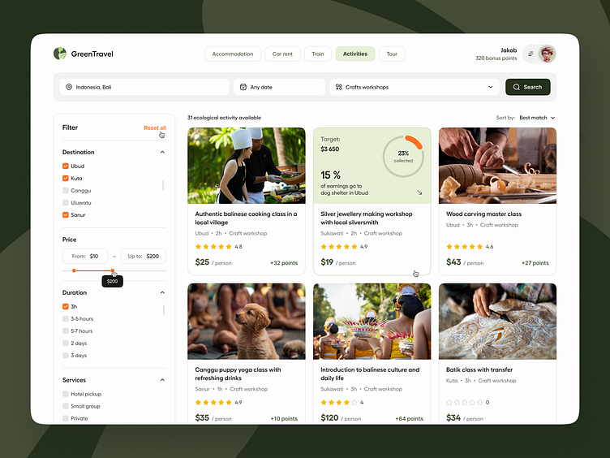

# Project Spec

## 0. Project Overview.

App Trips is an Angular App that will be the main place for our users to see data about trips.

## 1. Software System

_This section describers the entire software system. This includes the users of the system, as well as all the applications, databases, and APIs the system is made of. The application that we're building (the customer-facing web app) is a part of this system._

### System Context

_This is a zoomed out view of the system and the surrounding context. The system context diagram below follows the guidelines of the C4 Model for visualizing software architecture._

#### System Users

- **User** — .

#### System Context Diagram

_To be completed...._

### System Containers

_These are the building blocks of the system. Use this list as well as the system context diagram above to build the container diagram for the software system._

- **User Web App** — This is the app that we're designing the architecture for. It's a web application used by users to see data about trips.
- **Core API** — REST API used by all web apps within the system.

#### Container Diagram

_To be completed..._

---

## 2. Customer Web Application

_This section describes the customer-facing application in more detail. It's meant to give a high-level understanding of the app we're designing the architecture for._

### UI Designs

### Functional Requirements

_This section lists some of the main functional requirements of the web app. This is more of a functionality overview to help guide some of the architectural decisions._

#### Browsing Trips

- Users can browse trips on the homepage.
- Trips are displayed with their name, basic traits and thumbnail.
- Users can sort trips by price, creationDate, rating, name or verticalType.

#### Trip Details

- Users can tap on a particular trip to see more details.
- The detail page displays the photo of the trip in a bigger size, and all the data, including the description.

#### Navigation

- Users can navigate back and forth between the detail and home page.
- If any sorting is applied, and detail is opened, navigating to home should preserve this order.

#### Trip of the Day

- There should be a button that gives us the "trip of the day" on the home page.
- The trip of the day should not change during the navigation and will remain the same for the whole day.

#### Ratings and Reviews

- Each trip should display a `score` badge based on `rating`, `nrOfRatings` and `co2` (the way to calculate it is up to you, but there should be 3 tiers assignable to the resulting score).

### Architectural Requirements

👉🏽 Check out the [requirements doc](./requirements.md).
